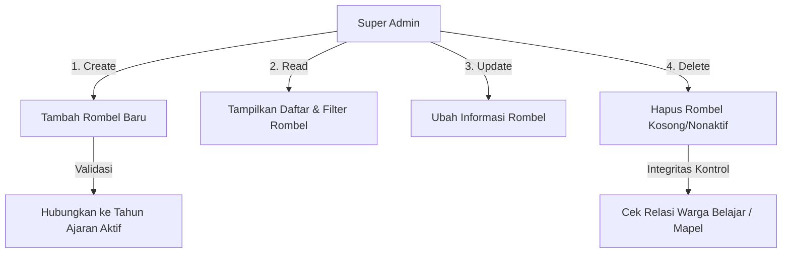
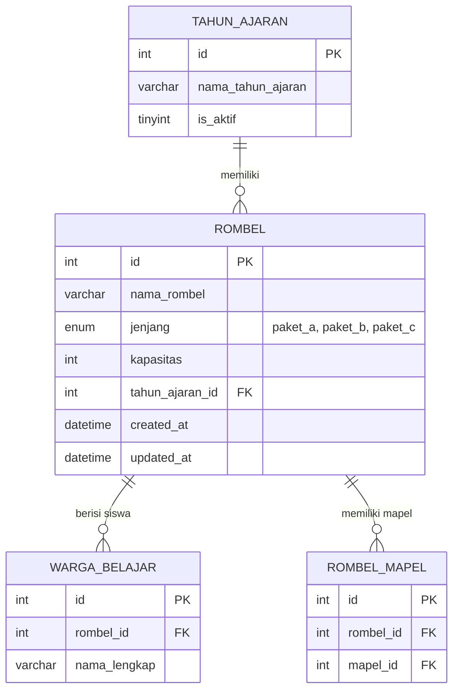

# SOFTWARE REQUIREMENTS SPECIFICATION (SRS)
## Modul Manajemen Rencana Rombongan Belajar (CRUD Kelas/Rombel)
**Sistem Informasi Manajemen Akademik (SIMAK) PKBM Bina Mandiri**

---

> [!NOTE]
> Dokumen ini dirancang sebagai panduan teknis (blueprint) untuk mengembangkan sistem manajemen kelas (Rombongan Belajar) secara mandiri bagi Super Admin. Fitur ini akan melengkapi kapabilitas administrasi akademik pada platform SIMAK.

---

### 1. PENDAHULUAN
#### 1.1 Latar Belakang
Pada versi saat ini, data kelas (tabel `rombel`) bersifat statis dan dikelola secara langsung melalui database manual. Untuk mendukung skalabilitas operasional PKBM Bina Mandiri, diperlukan sebuah antarmuka grafis (GUI) di panel **Super Admin** untuk mengelola data kelas secara dinamis, transparan, dan realtime.

#### 1.2 Tujuan
* Menyediakan fitur CRUD (Create, Read, Update, Delete) data kelas/rombel.
* Menjaga integritas data siswa (`warga_belajar`) dan jadwal mengajar (`rombel_mapel`) melalui penanganan status relasi database.
* Mempermudah penempatan rombel baru pada Tahun Ajaran yang aktif.

---

### 2. KEBUTUHAN FUNGSIONAL (FUNCTIONAL REQUIREMENTS)



#### 2.1 Deskripsi Fitur CRUD

| Kode Req | Nama Fitur | Deskripsi | Aktor |
|---|---|---|---|
| **REQ-01** | **Tampil Daftar Rombel** | Menampilkan seluruh daftar rombel aktif pada Tahun Ajaran yang sedang berjalan disertai pencarian kata kunci dan filter Jenjang. | Super Admin |
| **REQ-02** | **Tambah Rombel Baru** | Input data nama rombel, jenjang pendidikan, kapasitas maksimum siswa, dan menghubungkannya dengan Tahun Ajaran yang aktif. | Super Admin |
| **REQ-03** | **Edit Rombel** | Memperbarui nama, jenjang, kapasitas, atau status aktif rombel. | Super Admin |
| **REQ-04** | **Hapus Rombel** | Menghapus data rombel dari sistem dengan proteksi integritas (tidak boleh dihapus jika masih ada siswa terdaftar). | Super Admin |

#### 2.2 Aturan Validasi Bisnis (Business Rules)
1. **Unik per Tahun Ajaran:** Nama Rombel tidak boleh duplikat pada Tahun Ajaran yang sama (contoh: tidak boleh ada dua kelas bernama "Paket C - Kelas X - A" di Tahun Ajaran 2025/2026).
2. **Kapasitas Positif:** Kapasitas siswa wajib berupa angka positif integer di atas 0 (rekomendasi: 1 - 100).
3. **Pengamanan Penghapusan:** Rombel yang memiliki relasi aktif di tabel `warga_belajar` (masih ada siswanya) atau `rombel_mapel` (masih terpasang mapel) **DILARANG** untuk dihapus. Sistem harus melempar pesan error informatif dan menyarankan penonaktifan rombel atau pemindahan data siswa terlebih dahulu.

---

### 3. ARSITEKTUR DATA & SKEMA DATABASE

Rancangan ini menggunakan struktur tabel `rombel` yang sudah ada, dengan penyesuaian query relasi ke tabel `tahun_ajaran`.



#### Detail Struktur Kolom Tabel `rombel`
* **`id`** `INT AUTO_INCREMENT PRIMARY KEY`
* **`nama_rombel`** `VARCHAR(100) NOT NULL` (Contoh: "Kelas X - Paket C - Merdeka")
* **`jenjang`** `ENUM('paket_a', 'paket_b', 'paket_c') NOT NULL`
* **`kapasitas`** `INT NOT NULL DEFAULT 30`
* **`tahun_ajaran_id`** `INT NOT NULL` (Foreign Key mengarah ke `tahun_ajaran.id`)
* **`created_at`** `DATETIME`
* **`updated_at`** `DATETIME`

---

### 4. RANCANGAN BACKEND API (REST API SPECIFICATION)

Semua endpoint dilindungi oleh middleware autentikasi dan otorisasi khusus Role **Super Admin**.

#### 4.1 GET `/api/akademik/rombel`
* **Deskripsi:** Mengambil semua daftar rombel dengan opsional filter dan pencarian.
* **Query Params:**
  * `keyword` (String) - Pencarian nama rombel.
  * `jenjang` (String) - Filter jenjang (`paket_a`, `paket_b`, `paket_c`).
* **Response Sukses (`200 OK`):**
  ```json
  {
    "success": true,
    "data": [
      {
        "id": 1,
        "nama_rombel": "Paket C - Kelas X - Merdeka 1",
        "jenjang": "paket_c",
        "kapasitas": 35,
        "tahun_ajaran_id": 2,
        "nama_tahun_ajaran": "2025/2026 Ganjil",
        "jumlah_siswa": 12
      }
    ]
  }
  ```

#### 4.2 POST `/api/akademik/rombel`
* **Deskripsi:** Menambah data Rombel baru.
* **Payload Body:**
  ```json
  {
    "nama_rombel": "Paket B - Kelas VII - Harapan",
    "jenjang": "paket_b",
    "kapasitas": 25,
    "tahun_ajaran_id": 2
  }
  ```
* **Response Sukses (`201 Created`):**
  ```json
  {
    "success": true,
    "message": "Rombongan Belajar berhasil ditambahkan.",
    "data": { "id": 5 }
  }
  ```

#### 4.3 PUT `/api/akademik/rombel/:id`
* **Deskripsi:** Memperbarui data informasi Rombel.
* **Payload Body:** (Sama seperti POST)
* **Response Sukses (`200 OK`):**
  ```json
  {
    "success": true,
    "message": "Data Rombongan Belajar berhasil diperbarui."
  }
  ```

#### 4.4 DELETE `/api/akademik/rombel/:id`
* **Deskripsi:** Menghapus Rombel jika tidak memiliki keterikatan relasi data.
* **Response Sukses (`200 OK`):**
  ```json
  {
    "success": true,
    "message": "Rombongan Belajar berhasil dihapus."
  }
  ```
* **Response Gagal Relasi (`400 Bad Request`):**
  ```json
  {
    "success": false,
    "message": "Gagal menghapus! Masih terdapat warga belajar atau mata pelajaran aktif terdaftar di dalam kelas ini."
  }
  ```

---

### 5. RANCANGAN FRONTEND UI (REACT SPECIFICATION)

Halaman baru akan dibuat di: `frontend/src/pages/admin/RombelAdmin.jsx`.

#### 5.1 Tata Letak Halaman (Layout Grid)
* **Header Halaman:** Judul premium "Manajemen Rombongan Belajar" dengan subteks informatif dan tombol emerald **"+ Tambah Rombel"** di pojok kanan atas.
* **Filter Bar:**
  * Kotak input pencarian (Realtime search) dengan icon kaca pembesar.
  * Dropdown select untuk memfilter berdasarkan **Jenjang** (Semua, Paket A, Paket B, Paket C).
* **Tabel Informasi Utama (Responsive):**
  * Kolom: # | Nama Kelas | Jenjang | Kapasitas | Tahun Ajaran | Jumlah Siswa Terisi | Aksi (Edit, Hapus).
  * Status Kapasitas: Progress bar indikator tingkat keterisian siswa (contoh: 12/35 terisi).

#### 5.2 Form Modal Tambah/Edit Rombel
* Input text untuk **Nama Kelas** (placeholder: *"Contoh: Kelas X Paket C"*).
* Dropdown untuk **Jenjang** (Paket A, Paket B, Paket C).
* Input number untuk **Kapasitas Siswa** (default: 30, min: 1).
* Dropdown dinamis untuk **Tahun Ajaran** (mengambil data dari endpoint `/api/akademik/options/tahun-ajaran` atau sejenis).

---

### 6. LANGKAH-LANGKAH IMPLEMENTASI (ROADMAP)

Gunakan daftar centang di bawah ini untuk menandai kemajuan pekerjaan Anda:

- [ ] **Langkah 1: Pengembangan Database**
  * Pastikan relasi tabel `rombel` ke `tahun_ajaran` di MySQL ter-setup dengan kunci asing (`FOREIGN KEY`).
- [ ] **Langkah 2: Pengembangan Backend API**
  * [ ] Tambahkan method CRUD di `backend/models/AkademikModel.js` (contoh: `createRombel`, `updateRombel`, `deleteRombel`, `checkRombelRelations`).
  * [ ] Buat handler method di `backend/controllers/AkademikController.js`.
  * [ ] Daftarkan endpoint route baru di `backend/routes/akademikRoutes.js` di bawah otorisasi `checkRole(ROLES.SUPER_ADMIN)`.
- [ ] **Langkah 3: Integrasi Frontend API**
  * Daftarkan fungsi pemanggilan axios di `frontend/src/services/api.js` (di bawah `AkademikAPI`).
- [ ] **Langkah 4: Pembuatan Komponen React UI**
  * [ ] Buat file halaman `frontend/src/pages/admin/RombelAdmin.jsx`.
  * [ ] Gunakan basis styling harmoni emerald green dan glassmorphism agar selaras dengan interface SIMAK PKBM lainnya.
  * [ ] Daftarkan path route `/dashboard/admin/rombel` di `frontend/src/App.jsx`.
- [ ] **Langkah 5: Pendaftaran Menu Sidebar**
  * Tambahkan menu navigasi **"Kelola Kelas / Rombel"** di dalam list `super_admin` pada file [Sidebar.jsx](file:///c:/Users/user/Documents/website%20praktek/web-pkbm-bina-mandiri-terbaru/pkbm-bina-mandiri/pkbm-bina-mandiri/frontend/src/components/Sidebar.jsx).
- [ ] **Langkah 6: Pengujian Sistem Akhir**
  * Uji fungsionalitas CRUD secara menyeluruh, pastikan fitur pengaman validasi relasi penghapusan bekerja dengan sempurna.
